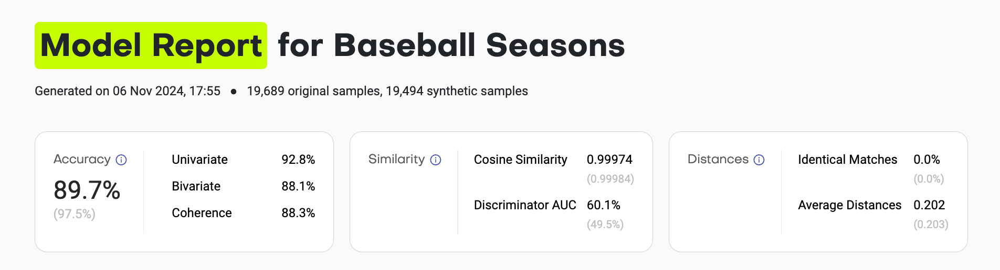
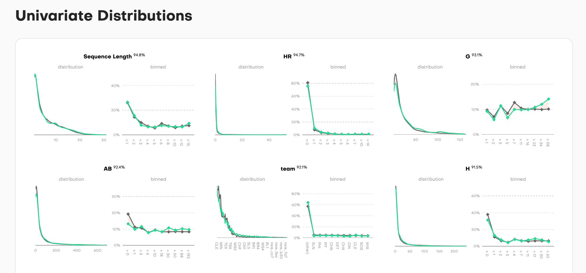
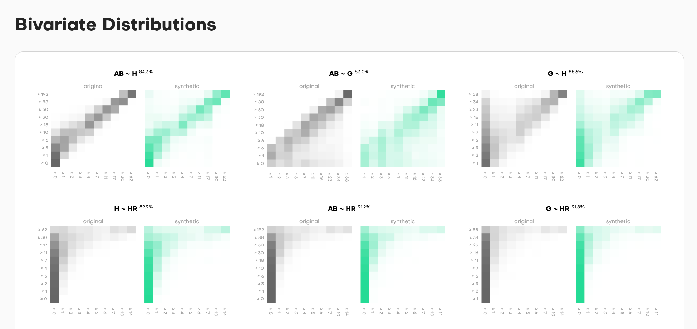
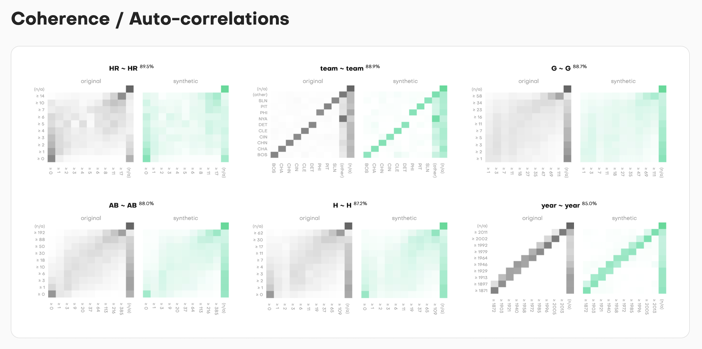
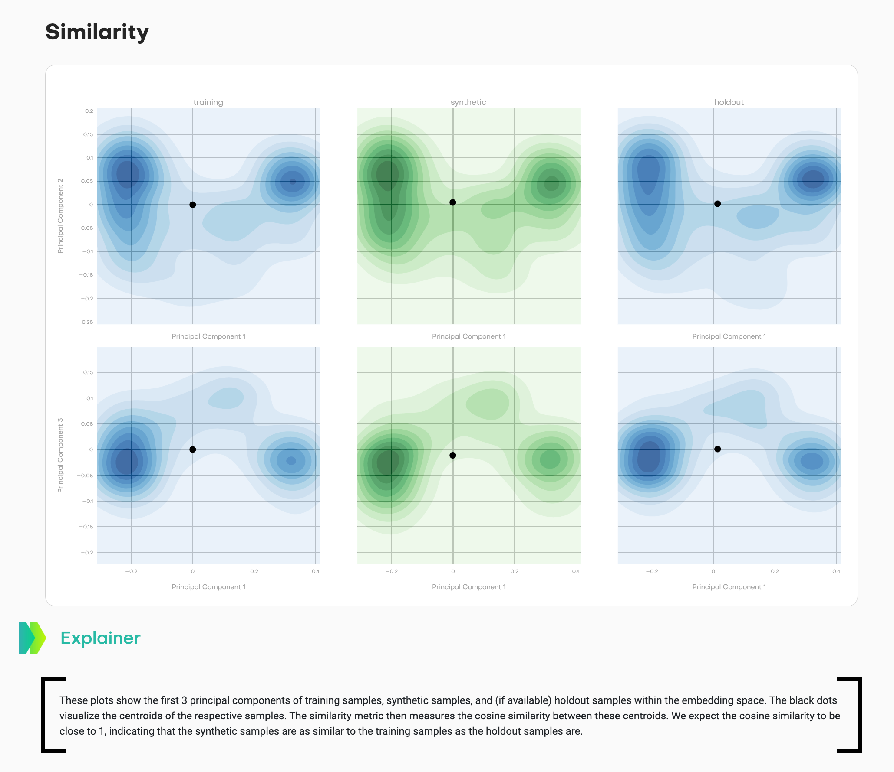
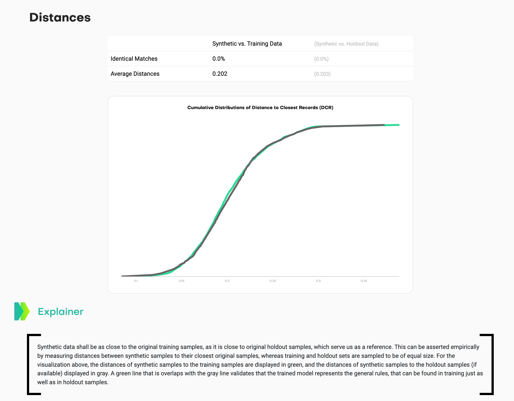

# Synthetic Data - Quality Assurance

Assess the fidelity and novelty of synthetic samples with respect to original samples:

1. calculate a rich set of accuracy, similarity and distance metrics
2. visualize statistics for easy comparison to training and holdout samples
3. generate a standalone, easy-to-share, easy-to-read HTML summary report

...all with a single line of Python code 💥.

## Getting Started

### Installation

```bash
pip install -U mostlyai-qa
```

### Basic Usage

```python
from mostlyai import qa

# analyze single-table data
report_path, metrics = qa.report(
    syn_tgt_data = synthetic_df,
    trn_tgt_data = training_df,
    hol_tgt_data = holdout_df,  # optional
)

# analyze sequential data
report_path, metrics = qa.report(
    syn_tgt_data = synthetic_df,
    trn_tgt_data = training_df,
    hol_tgt_data = holdout_df,  # optional
    tgt_context_key = "user_id",
)

# analyze sequential data with context
report_path, metrics = qa.report(
    syn_tgt_data = synthetic_df,
    trn_tgt_data = training_df,
    hol_tgt_data = holdout_df,  # optional
    syn_ctx_data = synthetic_context_df,
    trn_ctx_data = training_context_df,
    hol_ctx_data = holdout_context_df,  # optional
    ctx_primary_key = "id",
    tgt_context_key = "user_id",
)
```

### Syntax

```python
def report(
    *,
    syn_tgt_data: pd.DataFrame,
    trn_tgt_data: pd.DataFrame,
    hol_tgt_data: pd.DataFrame | None = None,
    syn_ctx_data: pd.DataFrame | None = None,
    trn_ctx_data: pd.DataFrame | None = None,
    hol_ctx_data: pd.DataFrame | None = None,
    ctx_primary_key: str | None = None,
    tgt_context_key: str | None = None,
    report_path: str | Path | None = "model-report.html",
    report_title: str = "Model Report",
    report_subtitle: str = "",
    report_credits: str = REPORT_CREDITS,
    report_extra_info: str = "",
    max_sample_size_accuracy: int | None = None,
    max_sample_size_embeddings: int | None = None,
    statistics_path: str | Path | None = None,
    on_progress: ProgressCallback | None = None,
) -> tuple[Path, dict | None]:
    """
    Generate HTML report and metrics for comparing synthetic and original data samples.

    Args:
        syn_tgt_data: Synthetic samples
        trn_tgt_data: Training samples
        hol_tgt_data: Holdout samples
        syn_ctx_data: Synthetic context samples
        trn_ctx_data: Training context samples
        hol_ctx_data: Holdout context samples
        ctx_primary_key: Column within the context data that contains the primary key
        tgt_context_key: Column within the target data that contains the key to link to the context
        report_path: Path of where to store the HTML report
        report_title: Title of the HTML report
        report_subtitle: Subtitle of the HTML report
        report_credits: Credits of the HTML report
        report_extra_info: Extra details to be included to the HTML report
        max_sample_size_accuracy: Max sample size for accuracy
        max_sample_size_embeddings: Max sample size for embeddings (similarity & distances)
        statistics_path: Path of where to store the statistics to be used by `report_from_statistics`
        on_progress: A custom progress callback
    Returns:
        1. Path to the HTML report
        2. Dictionary of calculated metrics:
        - `accuracy`:  # Accuracy is defined as (100% - Total Variation Distance), for each distribution, and then averaged across.
          - `overall`: Overall accuracy of synthetic data, i.e. average across univariate, bivariate and coherence.
          - `univariate`: Average accuracy of discretized univariate distributions.
          - `bivariate`: Average accuracy of discretized bivariate distributions.
          - `coherence`: Average accuracy of discretized coherence distributions. Only applicable for sequential data.
          - `overall_max`: Expected overall accuracy of a same-sized holdout. Serves as reference for `overall`.
          - `univariate_max`: Expected univariate accuracy of a same-sized holdout. Serves as reference for `univariate`.
          - `bivariate_max`: Expected bivariate accuracy of a same-sized holdout. Serves as reference for `bivariate`.
          - `coherence_max`: Expected coherence accuracy of a same-sized holdout. Serves as reference for `coherence`.
        - `similarity`:  # All similarity metrics are calculated within an embedding space.
            - `cosine_similarity_training_synthetic`: Cosine similarity between training and synthetic centroids.
            - `cosine_similarity_training_holdout`: Cosine similarity between training and holdout centroids. Serves as reference for `cosine_similarity_training_synthetic`.
            - `discriminator_auc_training_synthetic`: Cross-validated AUC of a discriminative model to distinguish between training and synthetic samples.
            - `discriminator_auc_training_holdout`: Cross-validated AUC of a discriminative model to distinguish between training and holdout samples. Serves as reference for `discriminator_auc_training_synthetic`.
        - `distances`:  # All distance metrics are calculated within an embedding space. An equal number of training and holdout samples is considered.
            - `ims_training`: Share of synthetic samples that are identical to a training sample.
            - `ims_holdout`: Share of synthetic samples that are identical to a holdout sample. Serves as reference for `ims_training`.
            - `dcr_training`: Average L2 nearest-neighbor distance between synthetic and training samples.
            - `dcr_holdout`: Average L2 nearest-neighbor distance between synthetic and holdout samples. Serves as reference for `dcr_training`.
            - `dcr_share`: Share of synthetic samples that are closer to a training sample than to a holdout sample. This shall not be significantly larger than 50\%.
    """
```

## Metrics

We calculate three sets of metrics to compare synthetic data with the original data.

### Accuracy

We calculate discretized marginal distributions for all columns, to then calculate the L1 distance between the synthetic and the original training data.
The reported accuracy is then expressed as 100% minus the total variational distance (TVD), which is half the L1 distance between the two distributions.
We then average across these accuracies to get a single accuracy score. The higher the score, the better the synthetic data.

1. **Univariate Accuracy**: We measure the accuracy for the univariate distributions for all target columns.
2. **Bivariate Accuracy**: We measure the accuracy for all pair-wise distributions for target columns, as well as for target columns with respect to the context columns.
3. **Coherence Accuracy**: We measure the accuracy for the auto-correlation for all target columns. Only applicable for sequential data.

An overall accuracy score is then calculated as the average of these aggregate-level scores.

### Similarity

We embed all records into an embedding space, to calculate two metrics:

1. **Cosine Similarity**: We calculate the cosine similarity between the centroids of the synthetic and the original training data. This is then compared to the cosine similarity between the centroids of the original training and holdout data. The higher the score, the better the synthetic data.
2. **Discriminator AUC**: We train a binary classifier to check whether one can distinguish between synthetic and original training data based on their embeddings. This is again compared to the same metric for the original training and holdout data. A score close to 50% indicates, that synthetic samples are indistinguishable from original samples.

### Distances

We again embed all records into an embedding space, to then measure individual-level L2 distances between samples. For each synthetic sample, we calculate the distance to the nearest original sample (DCR). We once do this with respect to original training records, and once with respect to holdout records, and then compare these DCRs to each other. For privacy-safe synthetic data we expect to see that synthetic data is just as close to original training data, as it is to original holdout data.

## Sample HTML Report








See the [examples](./examples/) directory for further examples.
